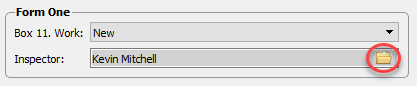
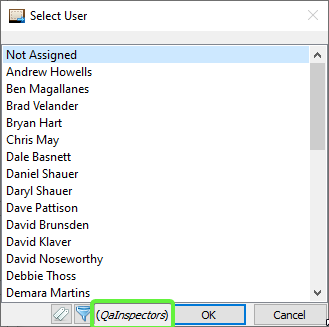
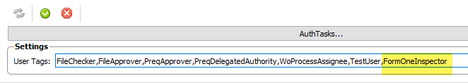
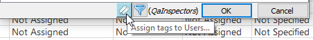
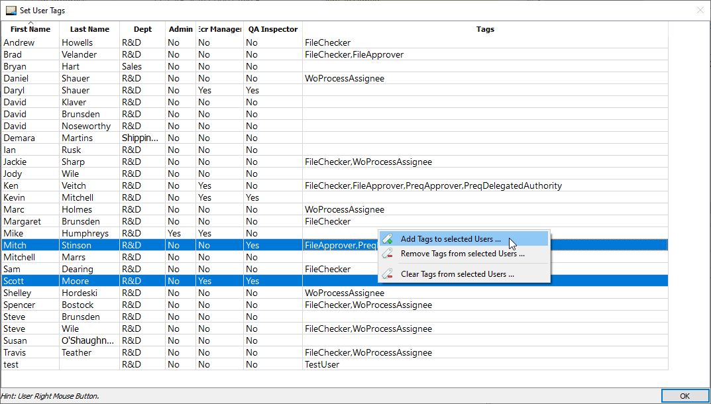
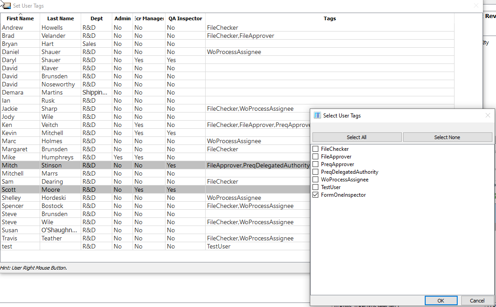
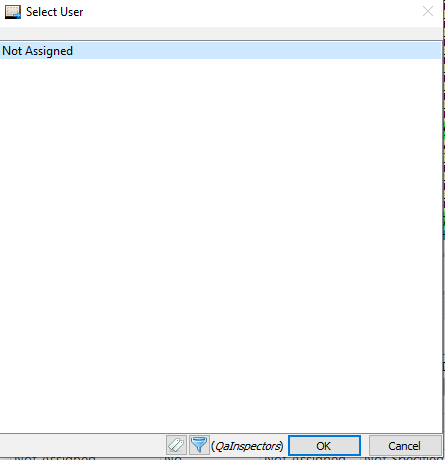
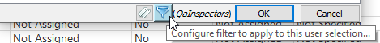
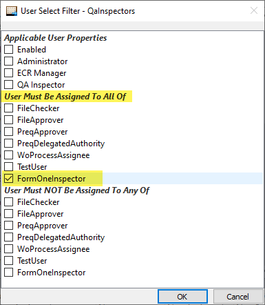
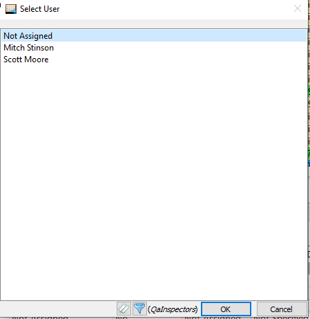

# User Select Filters

Since v0.28, AppCOM allows User selection lists to be filtered in order to limit the Users that can be assigned to any particular field.

## Example

Let's use the selection of a Work Order's Form One Inspector as an example of how to limit the Users that can be selected as the Form One Inspector.

When the Select User dialog is opened, notice the Filter Name `QaInspectors` is specified.  This means "Only Users that match the `QaInspectors` filter criteria will be displayed in this dialog".  
The Filter Name is programmed in AppCOM for most User Select dialogs.

## Set Filter Criteria

The basic steps are as follows:
1. Create a new User Tag that can be assigned to users.
1. Assign the new User Tag to any users you want to be included in the selection.
1. Assign the new User Tag to the User Select control's filter.

### Create User Tag

In the **AppCOM Settings Manager - Authorization - User Settings** panel, create a new User Tag called *FormOneInspector* (the name doesn't really matter, but should be unique and descriptive).

This tag will be assigned to the Users that can be selected as Form One Inspectors and applied to the User selection control.

!!! Note  

    Make sure to not leave spaces between tags.  
    Make sure to save your changes (green check mark).

### Assign User Tag to Users

Go back to the Work Order form and open the Inspector User Select dialog:

Next, click on the User Tags button:

Select the Users to whom you want to assign the tag, then right click and select **Add Tags to selected Users...**

The **Select User Tags** dialog will open. Check the the *FormOneInspector* tag we created earlier.

When you close the dialog, you'll notice the Select User list is empty. We have to apply the tag to the **Inspector User Select** dialog.

### Assign Tag to Filter

Click on the Filter button:

In the **User Select Filter** dialog, check the the *FormOneInspector* tag in the ***User Muts Be Assigned To All Of*** section:

After closing the dialog, you'll notice only Users that have been assigned the tag are displayed.

## Extra Info

* User Filters are global in nature.
* Filters can be modified only by AppCOM Administrators or Users that have been assigned the `UserSelectFilters` permission.

## Under The Hood

* The User Filters are stored in the database table `appcom.user_select_filters`.
* The User Select dialog is implemented in `AppCOM\src\ac2data\widgets\userselect-widget.cpp`.

