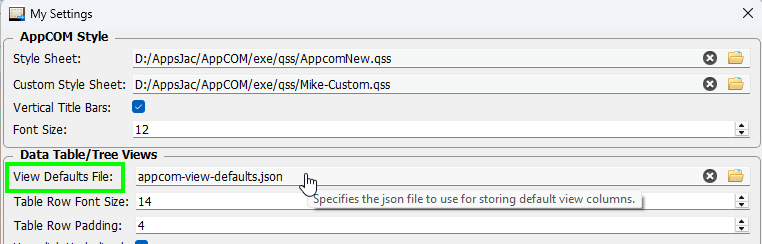
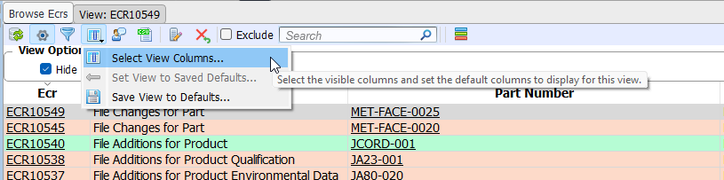
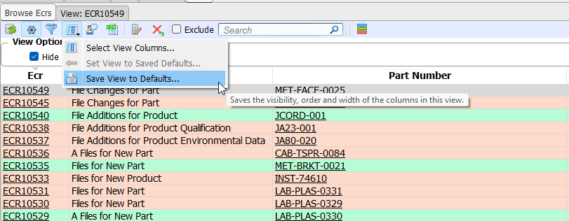
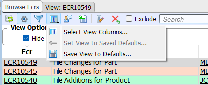

### Default View Settings

AppCOM now allows users to save the visibility, order and widths of columns in table and tree views to a file.

### File

By default, the default view settings are saved to _appcom-view-defaults.json_ in the user's AppCOM folder.

The file can be copied to share with other users.

The file to use can be  specified in the _Tools - Edit Preferences..._ menu:

/// caption
My Settings - Views Defaults File.
///

### Set View's Visible Columns

Use the _Select View Columns..._ item in the view's column menu.

/// caption
Select the columns you wish to have displayed in the view.
///

### Save View

When the view has been tailored to your liking (after selecting the visible columns, arranging their order and adjusting their widths), use the _Save View to Defaults..._ item in the view's column menu.

### Restore View

Use the _Set View to Saved Defaults..._ item in the view's column menu.

!!! note
    If the view has not been previously saved, the _Set View to Saved Defaults..._ menu item will be disabled.

    
