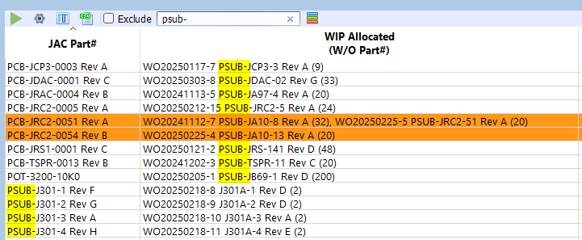
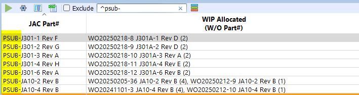
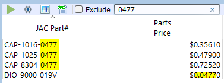
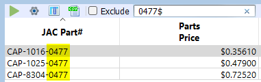
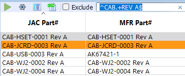

# Searching

The search bar found in many of the table views supports regular expressions.

When you enter a search term and press Enter, all of the visible columns in the view are included in the search.

## Common Searches Patterns

### Begins With `^`

Example:

Firstly, we search for `PSUB-` and note that many rows are returned that contain `PSUB-` in either the Part# or Allocated column.

To narrow the search to just `PSUB-` Part#s, we can add the begins with regex pattern `^` to the search term:

### Ends With `$`

Search for `0477`:  

Ends with `0477`:  

!!! tip
    If you want to search for a `$` or `^`, you need to escape it with `\`  
    Eg. `\$` will return rows that have columns containing `$` in their text.

### Match Any Character `.`

`.+` One or more characters:  
`CAP-.+`

### Examples

Begins with `CAB` and ends with `REV A`: `^CAB.+REV A$`  

