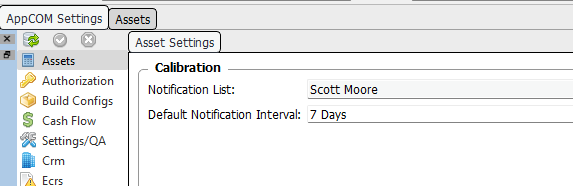
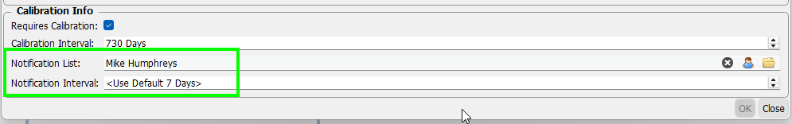
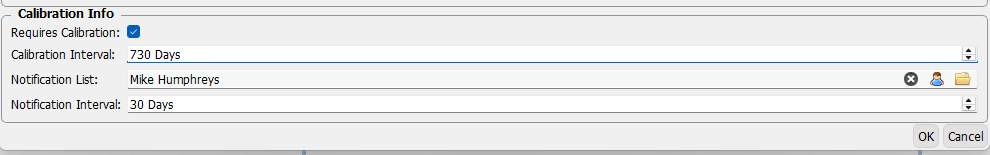

# Assets Manager

This page contains notes about the more obscure features of the Assets Manager.  

## Asset Calibrations

### Notifications

**Introduced in v33.2.1**

Users can be setup to receive notifications when an Asset is due for calibration.

A user can be notified for specific Assets and/or added to the default Asset notification list.

A notification interval can also be set which specifies the number of days before a calibration is due to notify the recipients.

### Default Notification List

Recipients and a notification interval are set in the Settings Manager.  

These people will be notified for *all* Asset calibrations that are coming due.

### Individual Asset Notification

In the Asset edit form, recipients can be added to the notification list and the notification interval can be overridden.

/// caption
Example 1 - Use Default Notification Interval
///

### Examples

In Example 1 above:

- Scott will be notified 7 days before a calibration is due for *all Assets.*
- Scott & Mike will be notified 7 days before the next calibration is due for the Asset being edited.

{ align=left }
/// caption
Example 2 - Override Notification Interval
///

- Scott & Mike will be notified 30 days before the next calibration is due for the Asset.

