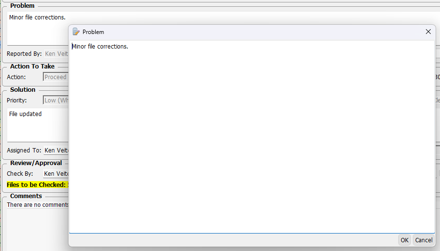

# Ecrs Manager

This page contains notes about the more obscure features of the Ecrs Manager.  

## Editing Ecrs

### Notification List

**New in v33.5.1**

- The list of Document Types that can be assigned to a Department are defined in *AppCOM Settings - Ecrs - Ecr Notification Departments*.
- For notification purposes, a user can be assigned to more than one department in *AppCOM Settings - Authorization - Department Members*.

### Project

**New in v33.2.1**

When the Project is changed, the Project Phase field is updated to reflect the current disposition from the Project's corresponding Project Lifecycle record.

### Text Fields

**New in v33.2.1**

The Problem and Solution fields can be double clicked to open a larger text edit dialog.

/// caption
Text Edit Dialog
///

