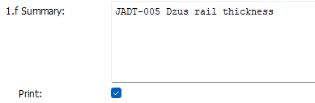
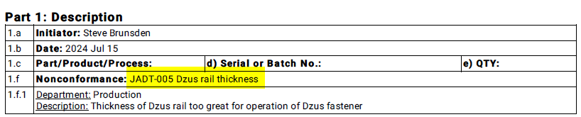
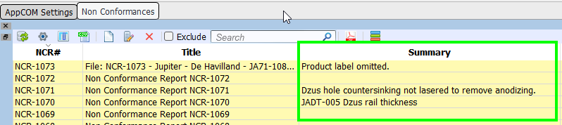
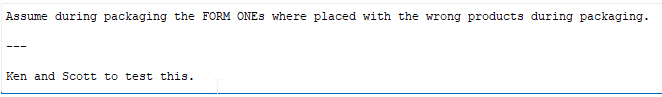
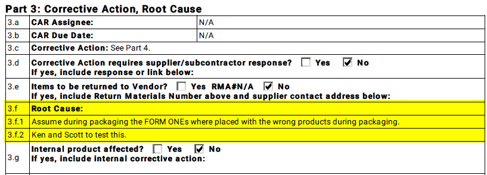
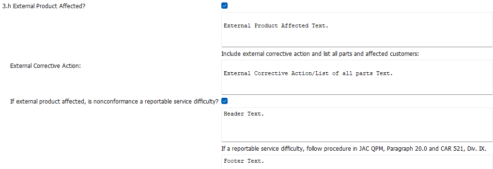
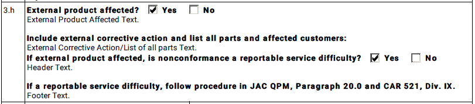
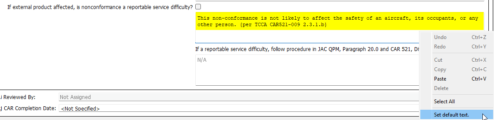
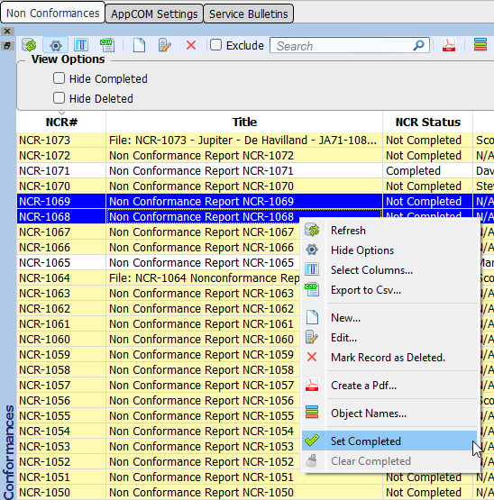

# Non Conformances Manager

This page contains notes about the more obscure features of the NCRs Manager.  

Introduced in **v33.1.1**

## Editing

### Formatting Text

The various box text editors have the following features:

* Double clicking opens a text edit dialog.
* Support for html, for example:

    **Bold** `<b>Bold</b>`

    *Italic* `<i>Italic</i>`

    ^^Underline^^ `<u>Underline</u>`

### Box 1.f Non Conformance

Optional Non Conformance Summary text can be specified.  
The summary text will be printed on the pdf only if Print Summary is checked:

=== "Text"

    

=== "Pdf Output"

    

It is displayed in the log in the Summary column:  

### Box 3.f Root Cause

Separate 3.f.n items can be specified by starting a line with `---`

=== "Text"

    

=== "Pdf Output"

    

### Box 3.h External Product Affected?

=== "Text"

    

=== "Pdf Output"

    

Default text for this box can be inserted via the context menu:

!!! note

    The default text can be set in in the AppCOM Settings/QA panel.

## Setting Completed Status

Use the NCR view's context menu to set/clear the completed status for selected NCR records.

!!! note

    The status can be modified only by AppCOM Administrators or Users in groups that have been assigned to the *Ncrs Advanced* task in AppCOM Settings.

## Generating Pdf

!!! note

    The default folder location where you are prompted to save NCR pdfs can be set in in the AppCOM Settings/QA panel.

## Reject Tags

To create a reject tag for a specific Part# associated with the NCR, select the Part# first, then create the Reject Tag.

The Part# and other associated fields will automatically be filled in.

Currently, reject tag pdfs are saved in your AppCOM *temp* folder.

!!! success "To Do"
    - [ ] Save reject tags to the default folder.
