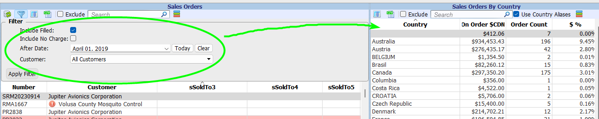
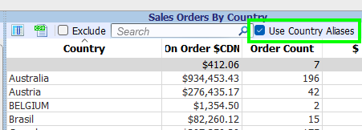
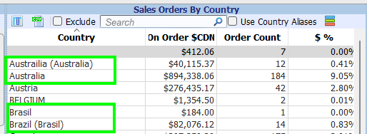
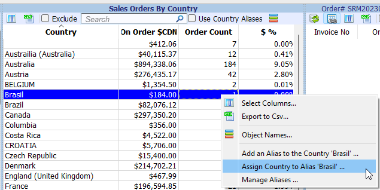
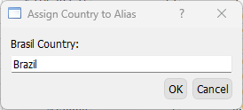
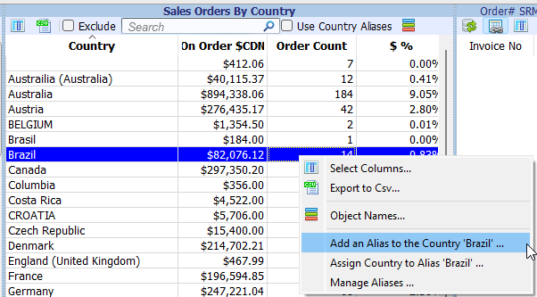
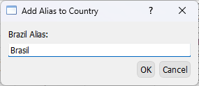
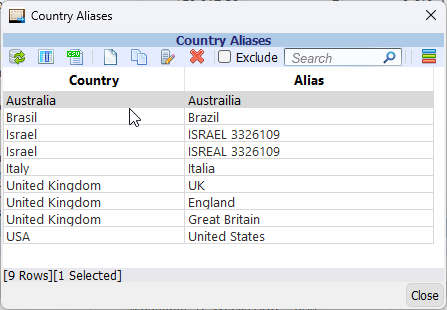

# Orders Manager

This page contains notes about the more obscure features of the Orders Manager.

## Sales Orders By Country

Introduced in **v33.2.1**

- Lists sales orders total dollar amounts grouped by country.
- Can be toggled on/off from the Order Tracking menu item in the main menu bar when the Orders Manager is active.

!!! Note  

    The data displayed in the view is generated from the filtered Sales Orders data.  
    

### Country Aliases

Country Aliases allow you to group countries stored in Simply Accounting together.  
Aliases are required, due to the fact that data is entered inconsistently into Simply.

#### Enabled

To see the data with country aliases grouped together, check *Use Country Aliases*.  

  
  /// caption
  Country Aliases Enabled
  ///

In this view, the country totals are summed together with the alias totals (eg Brazil + Brasil)  

#### Disabled

To see the raw data without country aliases grouped together, uncheck *Use Country Aliases*.  
  
  
  /// caption
  Country Aliases Disabled
  ///

In this view, if the country is an alias, the country it has been assigned to is shown in (brackets).

#### Adding Aliases  

Use the view's context menu to add/remove aliases.

As an example, `Brasil` can be made an alias for `Brazil` in one of three ways:

##### First Method: 

In this example, the country `Brazil` is assigned to the alias `Brasil`.  
Right click on *Brasil*

##### Second Method: 

In this example, the alias `Brasil` is added to the country `Brazil`.  
Right click on *Brazil*

##### Third Method:

Use the Country Aliases Management Dialog.  
Choose *Manage Aliases ...* from the context menu.

#### Managing Aliases

{ align=left }
/// caption
Country Aliases Management Dialog
///

## Under The Hood

* The Country Aliases are stored in the database table `appcom.country_aliases`.