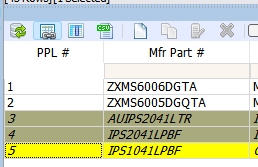

# Parts Manager

This page contains notes about the more obscure features of the Parts Manager.  

## Setting Part PPL Order

Other than setting a PPL as PPL#1, there is no other way to order the PPLs.

If you want to have them listed in a specific order, you need to make each PPL the #1 PPL in the reverse order in which you want them numbered.

In the example above, first make IPS1041LPBF PPL#1, then IPS2041LPBF PPL#1 and so on, lastly making ZXMS6006DGTA PPL#1.