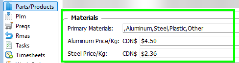
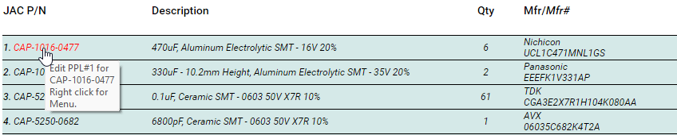
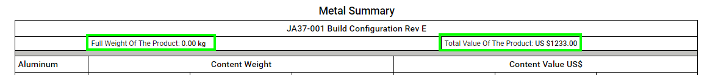

# Parts Lists Manager

This page contains notes about the more obscure features of the Parts Lists Manager.  

## Metal Report

Introduced in **v33.4.5**

By default, only Parts that have their PPL#1 Primary Material set to either Steel or Aluminum are displayed in the report.

To see all the parts, check the *Show Non Metal Parts* box at the top of the report.  Note that non metal parts are not included in the metal summary.

In the Metal Summary, the countries are listed in descending order by total value.

### Fab Parts vs Purchased Parts

A part is considered a Fab Part when it has its PPL#1 Manufacturer set to JAC.  
All other parts are considered purchased parts.  

When calculating the metal content value for a Fab Part, the Part's net weight is multiplied by the price of Aluminum or Steel that has been set in the Settings Manager.

When calculating the metal content value for a Purchased Part, the Part's inventory price is used.

### Global Metal Prices

Set in the Settings Manager

### Editing Data

The following data can be edited directly from the Metal Report:

- Part PPL#1 Data  
  Click on a Part Number to edit its PPL#1.  
  The PPL fields pertaining to this report are most notably:  
    - Part Net Weight
    - Primary Material
    - Country Of Origin
    - Substantiating Data

- Product Weight  
  Click on the *Full Weight Of The Product* title to open the appropriate editor for the Part List product.

- Product Value  
  Click on the *Total Value Of The Product* title to open the appropriate record in the Price List Manager.

