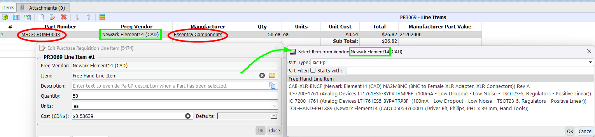

# Purchase Requisitions Manager

This page contains notes about the more obscure features of the Preqs Manager.  

## Editing Line Items

### Why isn't the Part selected in the form?

Even though a part has been selected for the line item, it shows up as a Free Hand Line Item when the form is opened.

This is caused when the Part's Manufacturer and the Purchase Req's Vendor are not the same.

Quite possibly, the Part's Manufacturer was changed after it was added to the Preq.

/// caption
Purchase Requisition Line Item Form
///

