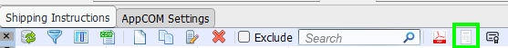
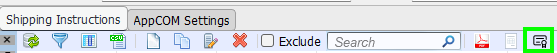
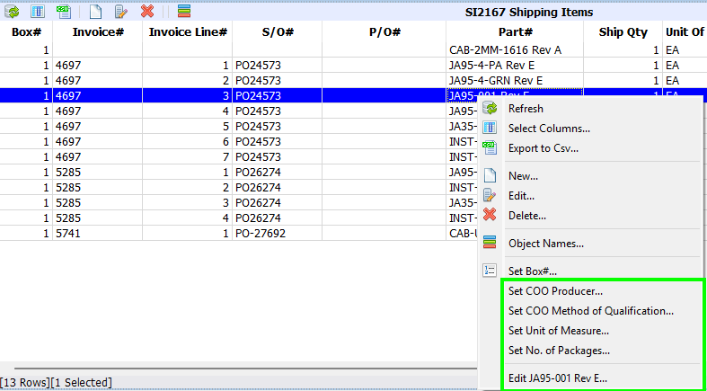
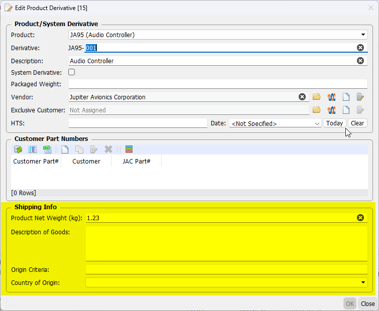
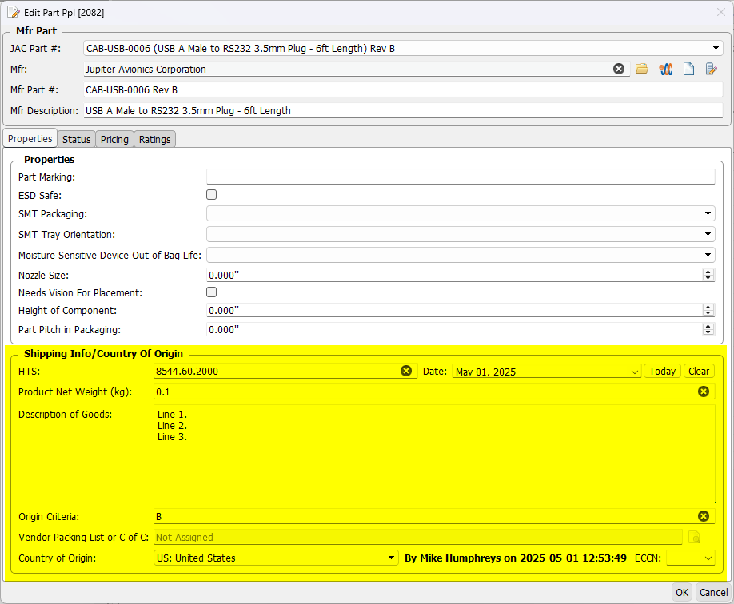

# Shipping Manager

This page contains notes about the more obscure features of the Shipping Manager.  

## Commercial Invoices

**New in v33.2.1**

/// caption
Commercial Invoice
///

Opens a form where you can edit the pertinent Shipping Record data for a Commercial Invoice as well as generate a pdf.

## Certificates Of Origin

**New in v33.2.1**

Opens a form where you can edit the pertinent Shipping Record data for a Certificates Of Origin as well as generate a pdf.

/// caption
Certificate of Origin
///

## Setting Shipping Item Data

The context menu enables you to quickly set values for multiple shipping item records.  

/// caption
Shipping Items Context Menu
///

You can also open the item's Part# editor from this menu to set the Part's Shipping Information.

/// caption
Product Shipping Info
///

/// caption
Part PPL#1 Shipping Info
///
