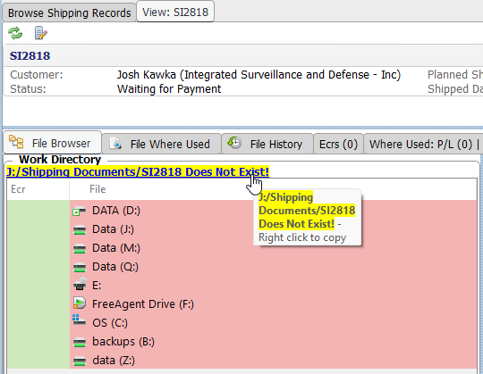
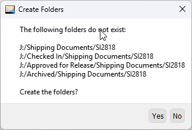
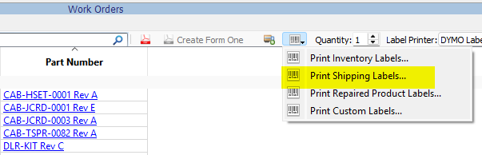
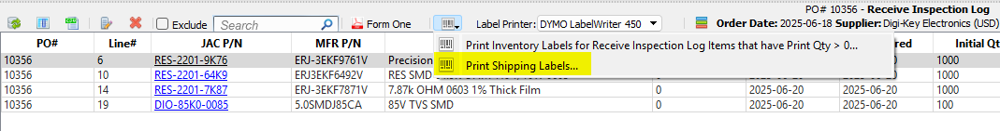
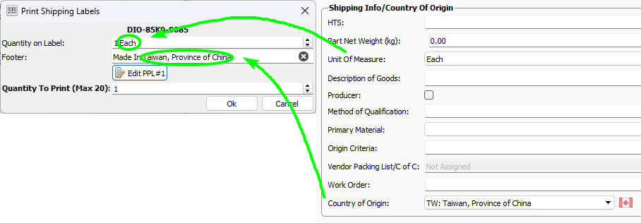

# Shipping Manager

This page contains notes about the more obscure features of the Shipping Manager.  

## Commercial Invoices

**New in v33.2.1**

/// caption
Commercial Invoice
///

Opens a form where you can edit the pertinent Shipping Record data for a Commercial Invoice as well as generate a pdf.

## Certificates Of Origin

**New in v33.2.1**

Opens a form where you can edit the pertinent Shipping Record data for a Certificates Of Origin as well as generate a pdf.

/// caption
Certificate of Origin
///

!!! note

    Certificate Of Origin and Commercial Invoice pdfs are saved in the record's J:/Shipping Documents/SIxxxx Work Directory.  
    You will want to create the SIxxxx folder before generating the pdfs by clicking on the folder link and selecting Yes.

     

## Setting Shipping Item Data

The context menu enables you to quickly set values for multiple shipping item records.  

/// caption
Shipping Items Context Menu
///

You can also open the item's Part# editor from this menu to set a Part's Shipping Information.

/// caption
Product Shipping Info
///

/// caption
Part PPL#1 Shipping Info
///

## Shipping Labels

Shipping Labels can be printed from the following locations:

1. Work Orders Manager  
  

2. Parts Manager - PPL - Batch or Work Orders tab.

3. Receive Inspections Manager  
  

### Shipping Label Dialog

The Unit of Measure and the Made In Country fields are extracted from the associated Part Number's PPL#1.  
Press the Edit button to change.

!!! note

    The footer text can be overriden, however it is not saved after printing the label.
