# Email Documents

As of **v33.1.2**, AppCOM allows users to email documents to a list of recipients.

## Overview

The documents can be chosen from any of the Managers that include a File Browser, such as the Parts and Products Managers.

The documents are sent as attachments in an email to a list of recipients from the [Email Files Dialog](#email-files-dialog).

## Choosing Documents

Select one or more documents in a File Browser, then right click and choose *Add Files to Email Queue.*

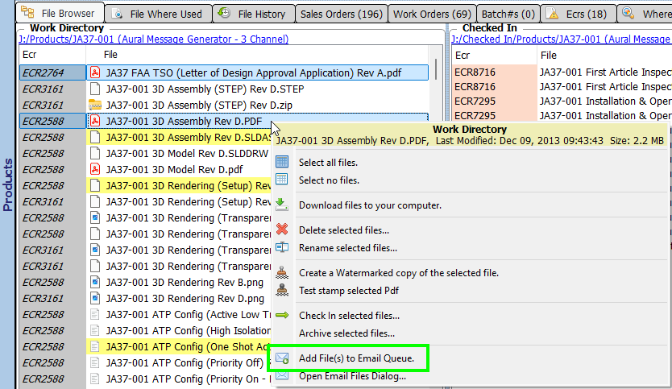
/// caption
Adding Documents to Email Queue
///

### Email Queue

- Is a list of documents that have been chosen on a per user basis, which means that each user will only see the documents that they have chosen.
- Is persistent between AppCOM sessions.
- Documents can be removed from the list in the [Email Files Dialog](#email-files-dialog).

---

## Email Files Dialog

This is where you compose and send emails with document attachments to a list of recipients.

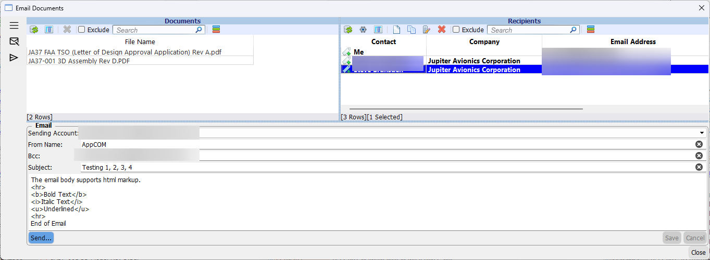
/// caption
Email Files Dialog
///

You can open the dialog from either the View Menu, or the context menu in the File Browser.  

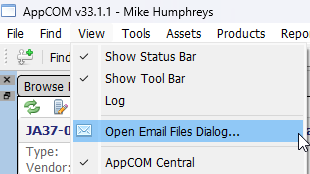

!!! Tip

    The dialog can moved to anywhere on your desktop and does not block you from interacting with other managers.
  

### Recipients List

- Is a list of email addresses that are stored on a per user basis, which means that each user will only see the recipients that they have created.
- Is persistent between AppCOM sessions.
- Recipients can be created from scratch or added from AppCOM contacts.
- Recipients can be excluded, which means they will not be included in the email.

#### Including/Excluding Recipients

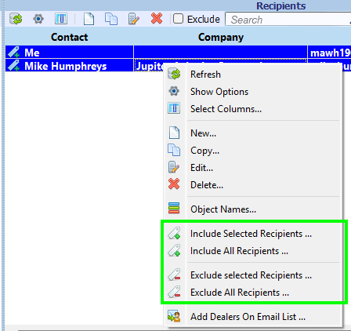

### Adding/Editing Recipients

Recipients can be added manually or chosen from an AppCOM Contact.

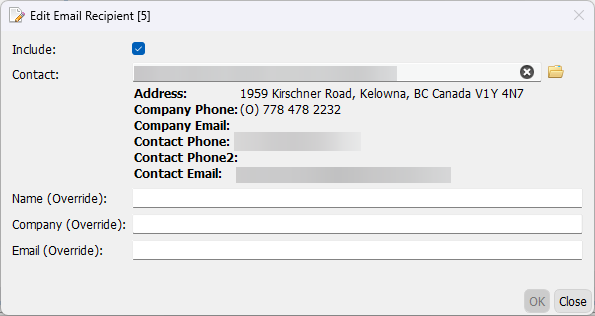

### Adding Dealers

All of the Contacts that have their `On Dealers Email List` property checked can be added in one fell swoop to the Recipients List:

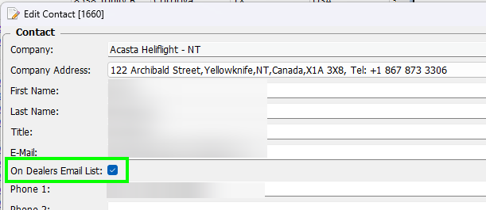

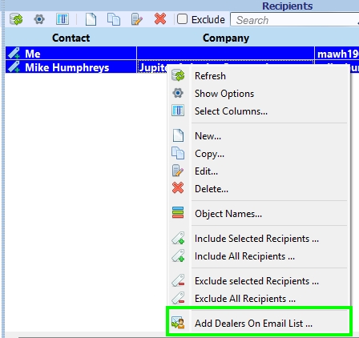

!!! tip

    To display only dealers that are on the Dealers Email List, choose `Show On Dealers Email List only` in the View Options.  
    
    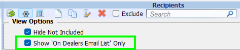

!!! tip

    You can run the `Add Dealers On Email List ...` function whenever Contacts are added to the Dealers Email List.  
    Duplicates will not be added to the Recipients list.

### Composing Email

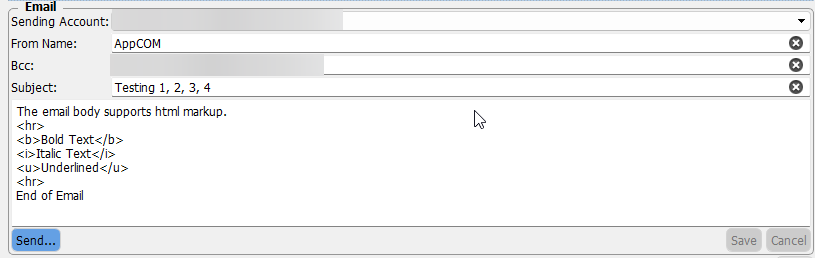

#### Sending Account

This is the email account that will be used to send the email.  You can only choose from a list of known accounts within AppCOM.

#### From Name

This is the name the end user will see in the From field in their email client.  
You can override the default account name if you wish.

#### Bcc

You can optionally enter a comma separated list of email addresses that you want to be blind carbon copied.  
For example, you may wish to have a copy of the email sent to yourself.

#### Subject

Email subject line.

#### Body

Email body, which supports html markup.  

!!! Tip

    Double clicking in this field opens a larger text edit dialog.  

---

## Send Email

The Recipients that are visible in the [Recipients List](#recipients-list) and have been Included are included in the Email.

Clicking on the *Send...* button will open a confirmation dialog that displays the email particulars:

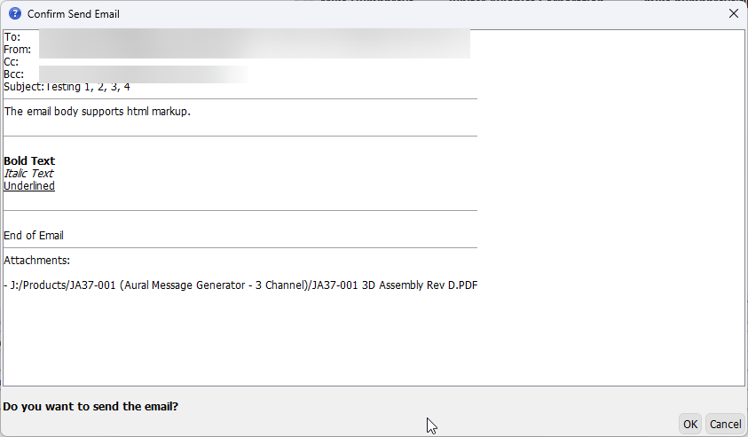
/// caption
Confirmation Dialog
///

---

## Send History

A full log of sent emails is maintained by AppCOM.  
Click on the History icon to display the log.

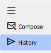

!!! note 
    
    The log displays emails sent by *all* users.

### By Date

Shows sent emails in chronological order.  

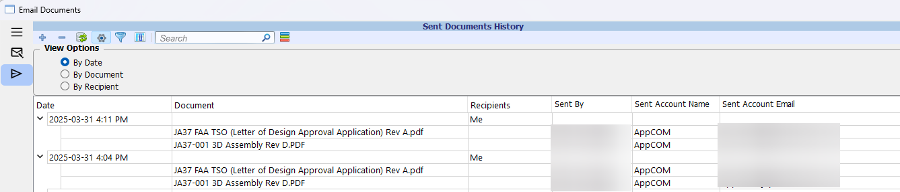
/// caption
By Date
///

### By Document

Shows documents in alphabetical order along with the dates they were sent in an email.  
Use Search to find specific documents.  

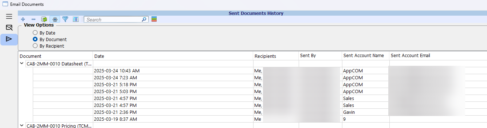
/// caption
By Document
///

### By Recipient

Shows recipients in alphabetical order along with the documents and dates they received an email.  

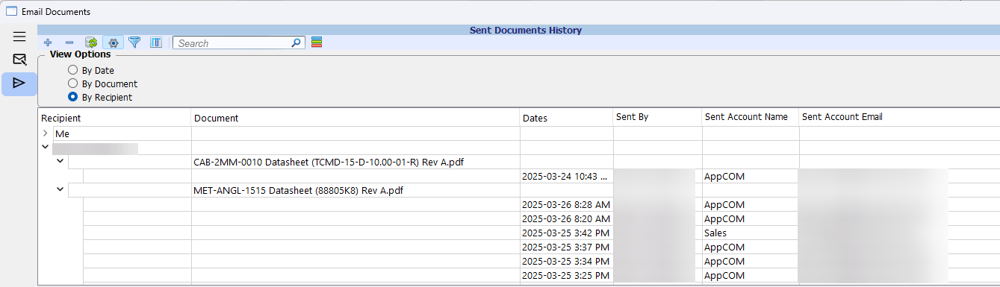
/// caption
By Recipient
///

!!! tip

    You can enter a date in order to limit the number of records listed.  
    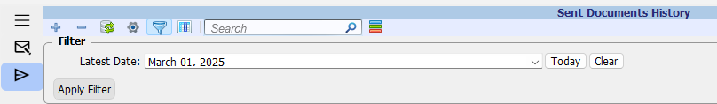

